# symbolic-ts

`symbolic-ts` changes a numeric time series into a short sequence of discrete tokens.
These tokens make a "symbolic language" for time series. A small language model can
learn this language in the same way that it learns words. The vocabulary does not
depend on the domain. Thus a model that learns from one domain (for example, finance)
can operate on a different domain (for example, an industrial sensor). A token means
the same thing in all domains.

This README describes each part of the library in the sequence that the data moves
through it. The plots come from the real library code. Nobody draws them by hand. To
make the plots again, run this command:

```bash
.venv/bin/python scripts/generate_readme_figures.py
```

The text follows ASD-STE100 Simplified Technical English. Code names, quoted output
and citations keep their original form.

## Pipeline overview

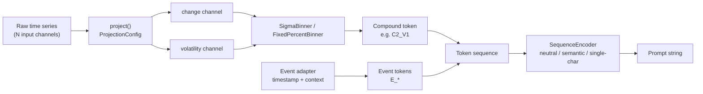

All domains go through the same three stages. Finance has some price and volume
columns. ETT has 7 sensor channels. A future system can have 100 or more sensors. The
output is always tokens from the same fixed vocabulary.

Event tokens (`F1-04`) show calendar and seasonal effects. They are a separate
namespace in the same sequence. They are not a fourth numeric channel. The last step
(`F1-05`) changes the token sequence into the text that a model reads.

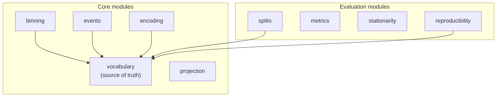

*An arrow means "imports from". Each module that needs token labels or the schema
version gets them from `vocabulary` only.*

## 1. Channel projection

**Module:** `symbolic_ts/projection.py`

The input can have 1 column or 100 columns. `project()` reads only one column
(`config.base_reading`). It makes two summary channels from that column: `change` and
`volatility`. It ignores all other columns.

The function stays the same for all domains. Only the `ProjectionConfig` value
changes.

```python
from symbolic_ts.projection import project, FINANCE_ADAPTER, ETT_ADAPTER

finance_projected = project(finance_df, FINANCE_ADAPTER)   # reads "Adj Close"
ett_projected = project(ett_df, ETT_ADAPTER)                # reads "OT"
```

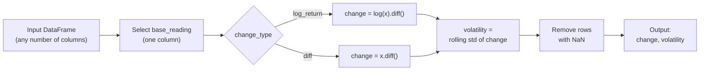

A domain adapter is a `ProjectionConfig` value. It is not an `if domain == ...` branch:

| Adapter | `base_reading` | `change_type` | Reason |
|---|---|---|---|
| `FINANCE_ADAPTER` | `Adj Close` | `log_return` | Price grows by multiplication over many years. A raw dollar difference thus follows the price level of the training period. A log return does not. |
| `ETT_ADAPTER` | `OT` | `diff` | The sensor reading does not have this growth trend. A plain difference is sufficient. |

The output has **no `level` channel**. Phase 0 tried the raw level and removed it. A
level is not stationary. A sigma threshold from one part of a series that grows or
drifts does not apply to a different part. The sum of `change` values already holds the
level information, without this problem.

**Missing values:** A NaN in the base reading goes into `change` (1 row). It also goes
into `volatility` (up to `volatility_window` rows), because a rolling std over a window
with a NaN is NaN. `project()` removes all these rows. The output never contains NaN.

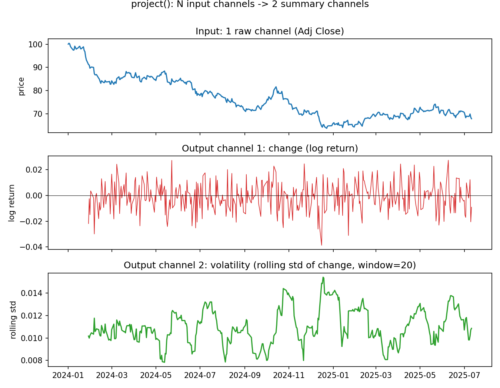

*The input is a synthetic geometric random walk. It replaces a real price series (see
`scripts/generate_readme_figures.py`). The numbers are not important. The shape is
important: one input series gives two summary channels. The volatility channel shows
calm periods and rough periods. A raw level does not show this directly.*

## 2. Sigma-based binning

**Module:** `symbolic_ts/binning.py`

Binning puts a continuous `change` or `volatility` value into one of 5 discrete
buckets. `SigmaBinner` measures the distance of a value from the mean, in standard
deviations. It calculates the mean and the standard deviation **one time, from the
training split only**:

```python
from symbolic_ts.binning import SigmaBinner
from symbolic_ts.vocabulary import NEUTRAL_CHANGE_LABELS

binner = SigmaBinner(labels=NEUTRAL_CHANGE_LABELS).fit(train_change)
tokens = binner.transform(test_change)   # never re-fits
```

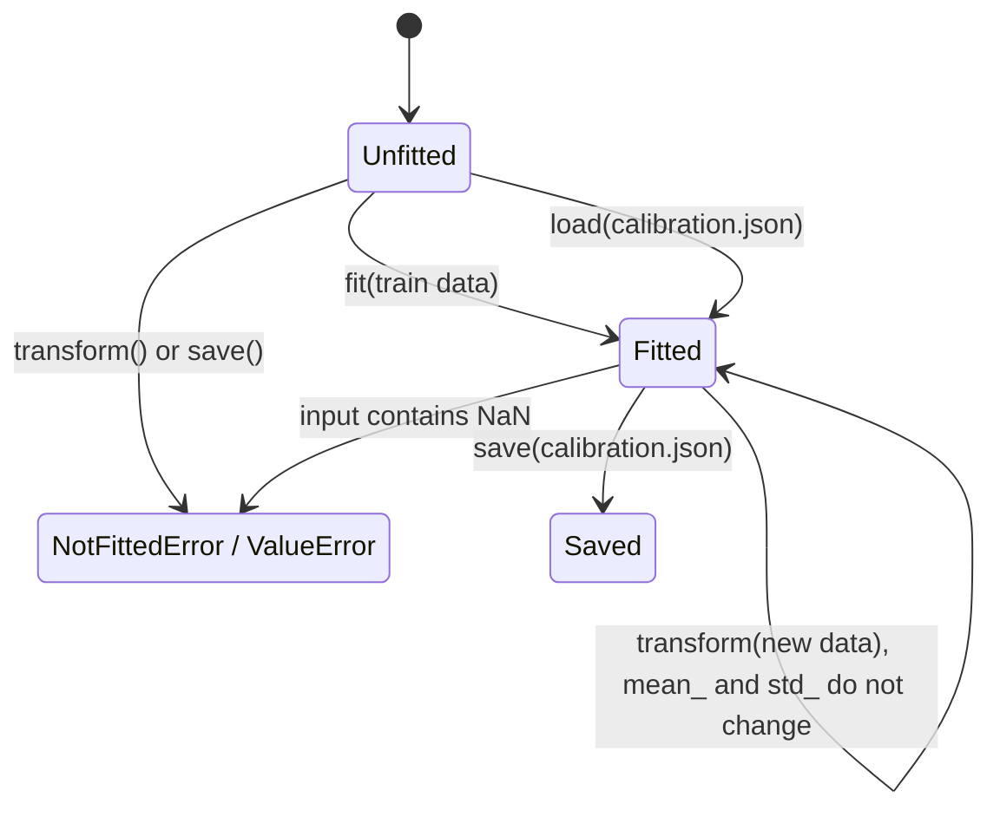

The separate `fit` and `transform` steps prevent one specific error. An old prototype
applied `qcut` to the *full* series. Thus information from the future went into each
token. A token in the test period then depended on
test-period data. If
you call `transform()` before `fit()` or `load()`, the binner raises `NotFittedError`.

The bucket edges are fixed at `[-1.5σ, -0.5σ, +0.5σ, +1.5σ]` around the training mean.
There are 5 buckets. The change channel uses `C0` (lowest) to `C4` (highest). The
volatility channel uses `V0` to `V4`:

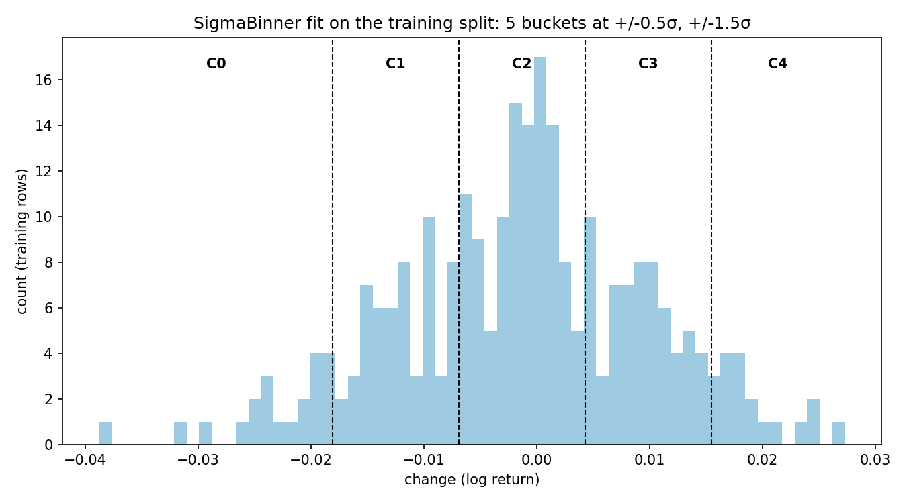

*This is the same synthetic series. The first 70% is the training split. The dashed
lines are the fitted `mean_ ± {0.5, 1.5}·std_` edges. `fit()` calculated them. Nobody
put them in by hand.*

**`log_scale=True`:** Volatility is not negative and has a long right tail. Symmetric
sigma bins on the raw value leave the lowest bucket almost empty. `log_scale` fits and
transforms on `log(x)`. The fit ignores values within `zero_tolerance` of zero. The log
makes these values into large negative outliers, and they then control the variance. In
the Phase 0 prototype, less than 2% of rows increased the fitted std by approximately
4.5 times.

The transform step still classifies these values with `log(x + log_epsilon)`.

`FixedPercentBinner` uses quantiles and has the same `fit`/`transform`/`save`/`load`
interface. It is for the E1 ablation. The thesis compares sigma buckets with
fixed-percentage buckets. This comparison is part of the evaluation.

**The binners refuse missing values.** `np.digitize` puts NaN in the *highest* bucket.
Thus a gap in the data becomes `C4`, an "extreme up-move" token. This token passes the
schema check, but it tells the model something false.

Both binners raise `ValueError` for NaN in `fit`
and in `transform`. In `fit`, NaN also makes `mean_` and `std_` NaN, and all later
tokens become `C4`. The values `±inf` still go to `C0` and `C4`, which is correct.
`log_scale` also refuses negative input, because its log is NaN.

`save()` and `load()` keep each binner in a JSON calibration file. The file contains the
`SCHEMA_VERSION` of the vocabulary. Thus a binner from a different schema version is
easy to find.

## 3. Token vocabulary

**Module:** `symbolic_ts/vocabulary.py`

The vocabulary is the single source of truth for valid token strings and what
they mean.
All other modules, and all other repositories, import labels from here. A compound
token has one change label and one volatility label. For example, `C2_V1` means "change
near the training mean, volatility one bucket below the middle". There are 5 × 5 = 25
compound tokens:

| | `V0` | `V1` | `V2` | `V3` | `V4` |
|---|---|---|---|---|---|
| **`C0`** | `C0_V0` | `C0_V1` | `C0_V2` | `C0_V3` | `C0_V4` |
| **`C1`** | `C1_V0` | `C1_V1` | `C1_V2` | `C1_V3` | `C1_V4` |
| **`C2`** | `C2_V0` | `C2_V1` | `C2_V2` | `C2_V3` | `C2_V4` |
| **`C3`** | `C3_V0` | `C3_V1` | `C3_V2` | `C3_V3` | `C3_V4` |
| **`C4`** | `C4_V0` | `C4_V1` | `C4_V2` | `C4_V3` | `C4_V4` |

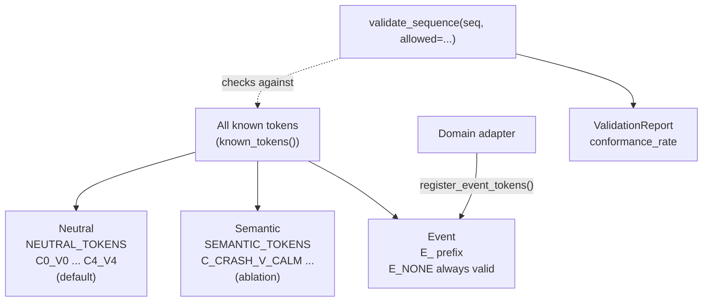

Two label sets have the same 5×5 shape:

- **Neutral** (`NEUTRAL_TOKENS`, the default): `C0`–`C4` and `V0`–`V4`, as above. No
  label tells the model what the number means.
- **Semantic** (`SEMANTIC_TOKENS`, an ablation): the same 25 buckets as words. Change:
  `CRASH, DROP, FLAT, RISE, SURGE`. Volatility: `CALM, LOW, MODERATE, HIGH, SURGE`.
  An example is `C_CRASH_V_SURGE`.

  The thesis measures if word labels change what the model learns. This is a research question, not a visual choice.

**Event tokens** are a third namespace with the `E_` prefix. They hold information that
is not a numeric channel, for example "this timestep is a weekend". `E_NONE` is always
valid. The adapter writes it when no event occurs, so the sequence length does not
depend on the number of events. Each domain adapter adds its own event tokens with
`register_event_tokens()` (`F1-04`). It does not change this module.

`validate_token()` and `validate_sequence()` check tokens against all known tokens. You
can also give one label scheme as `allowed=`. Thus you can make sure that a model with
neutral labels never writes a semantic label. `validate_sequence()` gives a
`ValidationReport` with a `conformance_rate`. The project reports this number.

## 4. Event tokens

**Module:** `symbolic_ts/events.py`

A domain event adapter changes one timestamp (and optional metadata) into one or more
event tokens. `EventAdapter` is a *structural* protocol, not a base class. Each object
that has an `events_for()` method with the same signature satisfies it. A third domain thus does not need
changes to this module. It needs only `register_event_adapter("my_domain", my_adapter)`.

```python
from symbolic_ts.events import ETTEventAdapter

adapter = ETTEventAdapter(
    holiday_dates=frozenset({date(2024, 3, 1)}),
    peak_hours=frozenset({18, 19, 20}),
)
adapter.events_for(datetime(2024, 3, 1, 19))  # -> ["E_HOLIDAY", "E_HOUR_PEAK", "E_SEASON_CHANGE"]
adapter.events_for(datetime(2024, 3, 4, 9))   # -> ["E_NONE"] -- explicit, never []
```

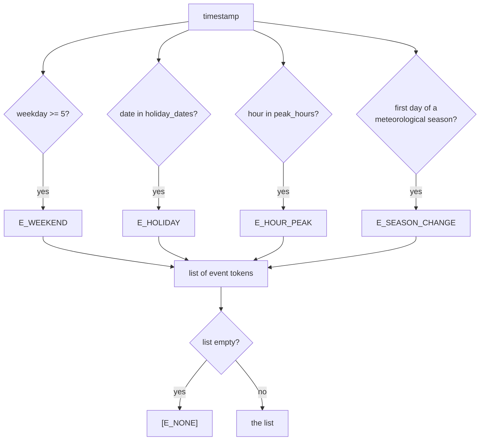

The caller must supply `holiday_dates` and `peak_hours`. They have **no built-in
default**. Phase 0 (F0-09) found a real 24-hour seasonal cycle in ETT. But Phase 0 did
not measure a peak clock hour or a holiday calendar. A default value here thus has no
evidence. `FinanceEventAdapter` has the same shape for earnings, dividend and FOMC dates.

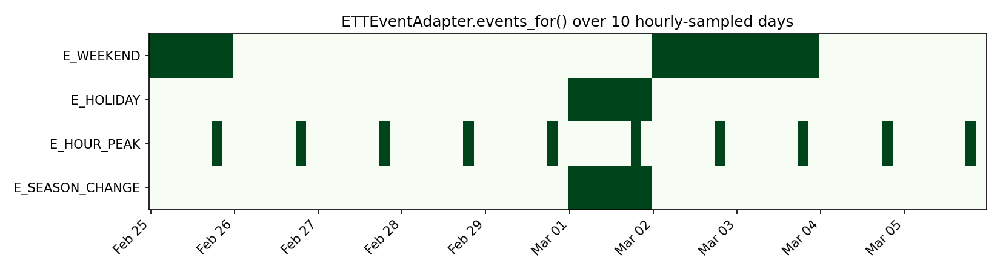

*The configured holiday on March 1st occurs together with `E_SEASON_CHANGE`.
Meteorological spring starts on the same day. This is only because of the example date.
The two checks are otherwise independent. `E_HOUR_PEAK` occurs at the same hours each
day, because `peak_hours` is a fixed set of clock hours.*

Each adapter registers all its event tokens in its `__post_init__`. Thus
`validate_token()` already knows a token before `events_for()` returns it.

## 5. Sequence encoders

**Module:** `symbolic_ts/encoding.py`

The last step changes a token sequence into the text that a model reads. Three encoders
have one interface. The comparison of the three **is** the E2–E4 representation
ablation. All three encode the *same* input sequence. They do not need a separate binner
for each label scheme:

```python
from symbolic_ts.encoding import NEUTRAL_ENCODER, SEMANTIC_ENCODER, SINGLE_CHAR_ENCODER

NEUTRAL_ENCODER.encode(tokens).text      # "C2_V1 E_NONE C0_V4 ..."
SEMANTIC_ENCODER.encode(tokens).text     # "C_FLAT_V_LOW E_NONE C_CRASH_V_SURGE ..."
SINGLE_CHAR_ENCODER.encode(tokens).text  # "L E_NONE D ..."
```

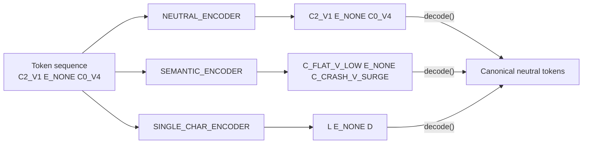

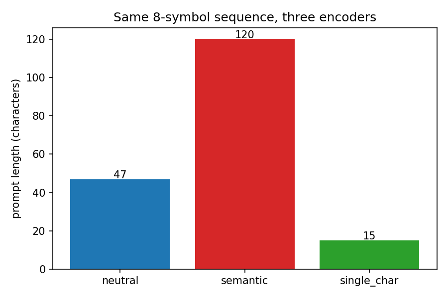

*The plot counts characters, not subword tokens. The plot must work offline, so it uses
a stand-in tokenizer with one token per character. The real subword-token values are in
the F0-09 notes of `symbolic-ts-research`: semantic ≈ 6.7 tokens per symbol,
single-character ≈ 1 token per symbol. This README does not calculate them again.*

`single_char` exists because semantic labels are expensive. One compound symbol costs
approximately 5–7 subword tokens. A 50-symbol context can then use one third of the
practical prompt budget of a 0.5B model.

`EncodedSequence.token_count(tokenizer)` accepts each object with an
`encode(text) -> Sequence` method. A Hugging Face tokenizer satisfies this. Thus the
library does not depend on one tokenizer package. `.metadata` contains
`{"encoding": ..., "schema_version": ...}` for MLflow. `decode()` always gives the
canonical neutral tokens. Downstream code thus does not need to know the encoder.

## 6. Splits, purging, and the test-set lock

**Module:** `symbolic_ts/splits.py`

`walk_forward_split()` makes expanding-window folds for development. Each fold has a
purge gap between training and validation. The gap is `context_len + embargo` long.
Without the gap, a training target near the boundary uses an input window that goes
into the validation fold. The model then learns from part of its own evaluation.

```python
from symbolic_ts.splits import walk_forward_split

folds = walk_forward_split(data, n_folds=4, context_len=50, embargo=5)
for fold in folds:
    train = data.iloc[fold.train_indices]
    validation = data.iloc[fold.validation_indices]
```

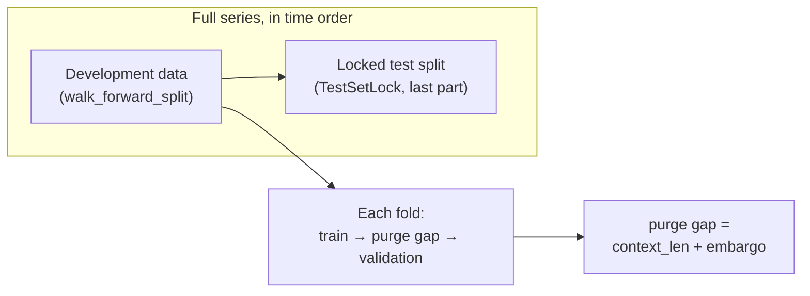

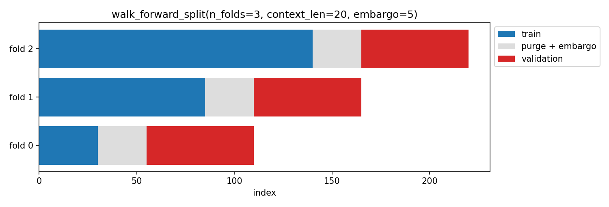

*The training window of each fold includes all data before its purge gap. Fold 2 thus
trains on much more data than fold 0. All folds keep the time order. This is the
advantage of walk-forward validation over one fixed train/test split.*

`TestSetLock` applies decision D9. It locks the real test set one time. It calculates a
hash of the data values at creation, not only of the indices. A change to the data thus
changes the hash.

It does not prevent access, because the model must run on the test
set at the Phase 4 gate. But no access can occur *silently*. D9 requires that the
thesis reports each read.

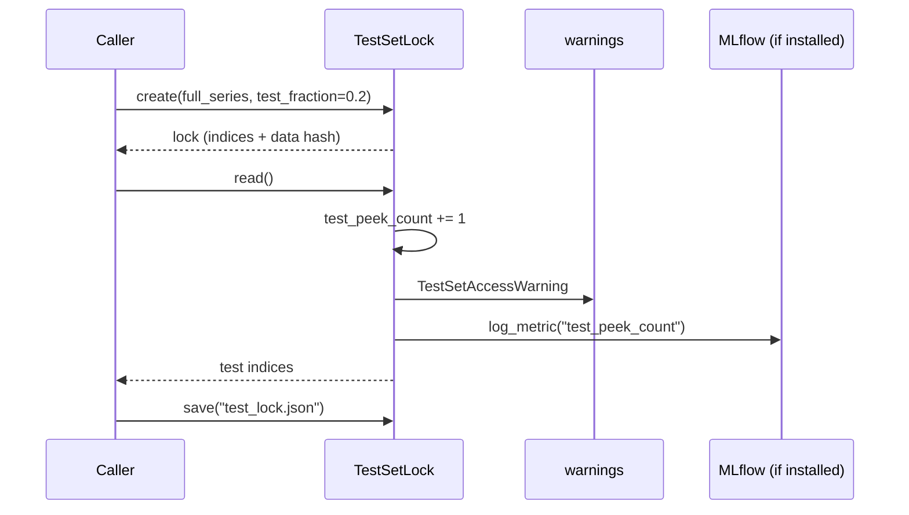

```python
from symbolic_ts.splits import TestSetLock

lock = TestSetLock.create(full_series, test_fraction=0.2)  # last 20%, chronological
lock.save("test_lock.json")
...
test_indices = lock.read()  # warns, increments test_peek_count, logs to MLflow
lock.save("test_lock.json")  # persist the incremented count
```

## 7. Metrics

**Module:** `symbolic_ts/metrics.py`

This module contains all metrics and statistical tests that the thesis reports. A test
checks each function against a worked numeric example. The docstring of the function
gives the source. Where possible, the source is a publication: Wikipedia's cited primary
sources, NIST's Statistical Engineering Handbook, or scikit-learn's documented examples.
Where no source exists, the example is hand-made and hand-checked, and the docstring says
so.

```python
from symbolic_ts.metrics import rmse, mae, directional_accuracy
from symbolic_ts.metrics import confusion_matrix, accuracy, macro_f1, mcc
from symbolic_ts.metrics import wilson_score_interval
from symbolic_ts.metrics import mcnemar_test, diebold_mariano_test, holm_correction

wilson_score_interval(successes=42, n=50, confidence=0.95)
mcnemar_test([[a, b], [c, d]])              # exact vs. chi-square chosen automatically
diebold_mariano_test(errors_a, errors_b)    # forecast-accuracy comparison
holm_correction([p1, p2, p3], alpha=0.05)   # once more than one pair gets compared
```

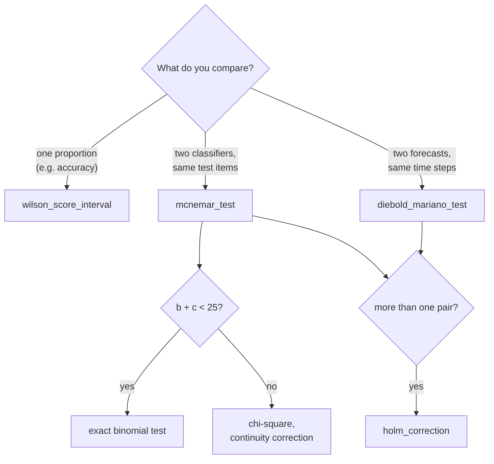

`wilson_score_interval` replaces the textbook normal (Wald) interval. The coverage of
Wald fails where this project needs it most. Classifier accuracy is a proportion, and it
is often near the extremes:

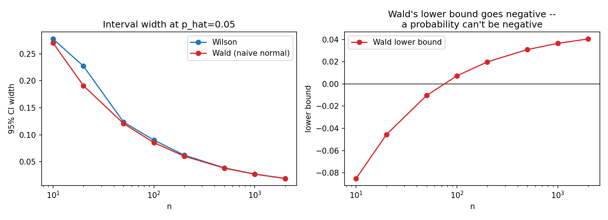

*At `p_hat=0.05` (a possible hit rate for one class of 25 tokens), the Wald lower bound
is negative for `n` below approximately 100. A probability cannot be negative. The
interval is thus wrong where sample sizes are small. The Wilson interval is asymmetric
and stays inside `[0, 1]` for all `n`.*

`mcnemar_test` and `diebold_mariano_test` are the two paired significance tests of this
literature. McNemar compares the errors of two classifiers on the *same* test items.
Diebold-Mariano compares the accuracy of two forecasts. `F4-02` will apply these tests
to many model pairs. `holm_correction` then corrects for multiple comparisons.

## 8. Stationarity helpers

**Module:** `symbolic_ts/stationarity.py`

ADF, KPSS, ACF and PACF answer the questions behind two design decisions. Which
transform makes the series stationary? This is why `change` is a difference (`F0-03`).
How far back does the memory go? This is why the context window is 50 tokens (`F0-09`).

This module is the only implementation of the four tools. The Phase 0 analyses and the
thesis pipeline thus get the same numbers from the same code.

```python
from symbolic_ts.stationarity import adf_test, kpss_test, acf_with_bounds, pacf_with_bounds

adf = adf_test(series)            # StationarityTestResult: statistic, p_value, lags, critical_values
kpss = kpss_test(series)
adf.is_stationary, kpss.is_stationary

acf = acf_with_bounds(tokens, nlags=300)   # Correlogram: lags, values, bounds
pacf = pacf_with_bounds(tokens, nlags=50)
pacf.outside_bounds()                       # which lags are significant
acf.first_lag_within_bounds(consecutive=3)  # where the series decorrelates
```

**The two tests have opposite null hypotheses.** For ADF, the null hypothesis is a unit
root (not stationary). For KPSS, the null hypothesis is stationarity. "Rejected" thus
has opposite meanings for the two tests. Each script that uses them can easily get this
wrong. `is_stationary` gives the correct direction one time:

| | ADF (H0: unit root) | KPSS (H0: stationary) |
|---|---|---|
| p < alpha | stationary | non-stationary |
| p >= alpha | non-stationary | stationary |

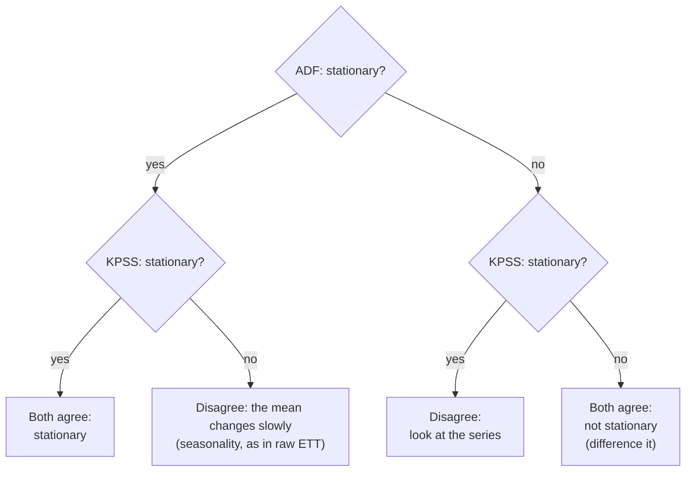

The two tests together give a strong result. When they agree, the conclusion is solid.
When they disagree, the cause is often a mean that changes slowly, not a random
walk. `F0-03`
found this on raw ETT: ADF said stationary, KPSS said not stationary.

KPSS p-values come
from a table for the range [0.01, 0.1] only. Outside this range, the value goes to the
edge, and `p_value_clipped` shows this.

**The ACF bound becomes wider, but the PACF bound does not.** The band for an
autocorrelation is as important as the value:

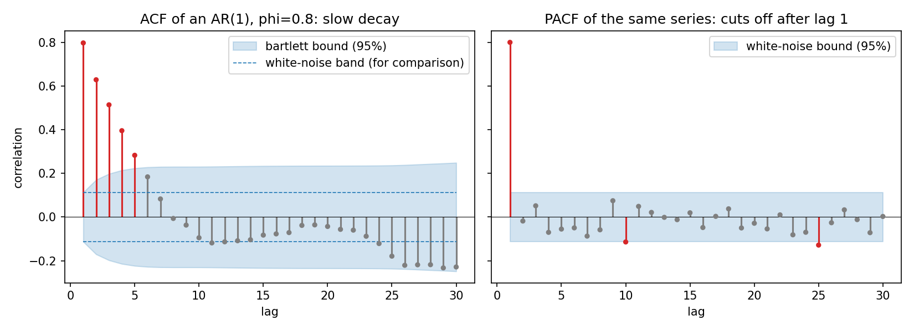

*An AR(1) series (phi=0.8, n=300) with a fixed seed goes through the real
`acf_with_bounds` and `pacf_with_bounds`. Left: the ACF decreases slowly. The Bartlett
bound (shaded) becomes wider with each autocorrelation below it. The constant
white-noise band (dashed) also marks lags 6, 11-12 and 24-30 as "significant". The
Bartlett bound puts only lags 1-5 outside. Right: the PACF stops after lag 1, as an AR(1)
must.*

*The two small crossings at lags 10 and 25 occur by chance. A 95% band over 30 lags
gives approximately 1.5 such crossings. For this reason, `first_lag_within_bounds`
requires several consecutive lags inside the band.*

This is the reason for the context window. A long ACF tail can come from a short direct
memory. The PACF separates the two. ADF and KPSS agree with the worked sunspots example
in the statsmodels documentation. The Bartlett bound agrees with the formula on NIST's
autocorrelation-plot page. The docstrings cite both sources.

## 9. Thesis invariants: what the test suite guards

**File:** `tests/test_thesis_invariants.py` (pipeline: `tests/_pipeline.py`)

Each module has its own unit tests. This file is different. It runs the real pipeline
from start to end: `project()` → test-set lock → walk-forward split → binners fit on the
training fold → tokens. It checks four ways that a thesis number can be wrong when each
module alone is correct:

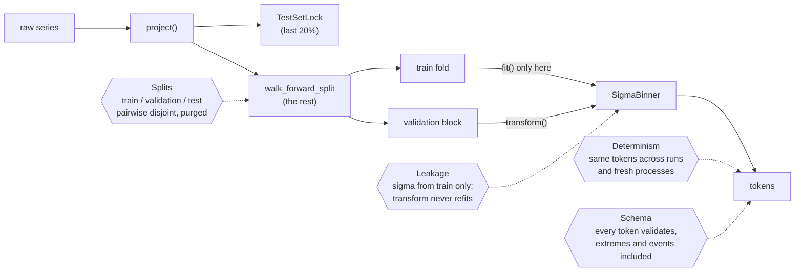

| Invariant | Risk to a result | Check |
|---|---|---|
| Determinism | If the tokens change between runs, no metric is reproducible. | SHA-256 of all output tokens: in the same process, and in two new interpreters with different `PYTHONHASHSEED`. |
| Leakage | A sigma fit on future data calibrates the tokens to the test period. | The series doubles its volatility halfway. The train-fold sigma differs from the full-data sigma. `fit` is replaced with a function that fails, and `transform` still runs. A reloaded calibration gives the same tokens without a fit. |
| Schema | A token outside the vocabulary, or a token with a wrong meaning, corrupts the training data. | All output tokens are valid. This includes spikes beyond ±1.5σ, zero-volatility periods and event tokens between them. The binners refuse NaN. |
| Splits | If indices overlap, the model can learn from its evaluation data. | For 1, 3 and 5 folds: train, validation and test are pairwise disjoint. The purge gap is larger than the context window. All folds come before the test split. |

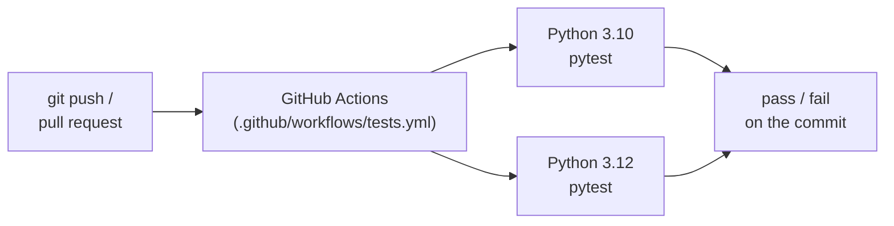

`tests/conftest.py` isolates two types of global state. Thus the test order does not
change the results. The first is the event-token registry, because each new adapter
registers its tokens. The second is MLflow: a test-split read logs `test_peek_count`, so
the run goes to a temporary directory and closes. CI runs all tests on each push, on
Python 3.10 and 3.12.

## 10. Reproducibility controls

**Module:** `symbolic_ts/reproducibility.py`

A number is reproducible only when two conditions are true. First, all random sources
have a seed. Second, a record of the environment stays with the number.
`reproducible_run(seed)` is the single entry point for both:

```python
from symbolic_ts.reproducibility import reproducible_run

with reproducible_run(42, run_name="T1-finance-to-ett") as run:
    ...  # the experiment
run.fingerprint["git_commit"], run.mlflow_run_id
```

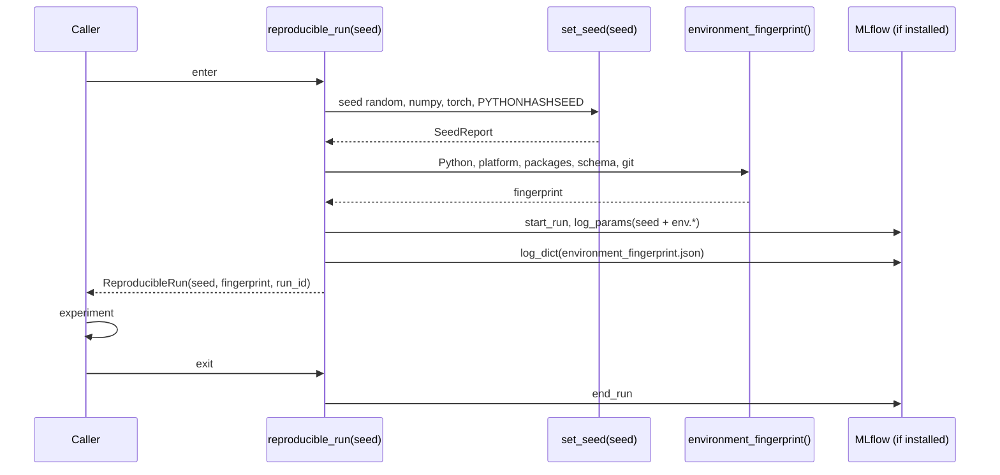

The fingerprint contains the Python version, the platform, the package versions, the
vocabulary `SCHEMA_VERSION` and the git commit. A package that is not installed has the
value `None`. `git_dirty` is `True` when the working tree has uncommitted changes. The
commit alone then does not identify the code. Without MLflow, the seeds and the
fingerprint still apply. Only the log step does not occur.

`set_seed` has two limits. The code cannot remove them, so the docstring and the tests
state them:

| Source | What `set_seed` does | Limit |
|---|---|---|
| `random`, NumPy global generator | seeds them | none |
| `torch` (CPU and CUDA) | seeds them, if torch is installed | none |
| `PYTHONHASHSEED` | sets the environment variable | Python reads it only at start. It applies to processes that start after the call, not to the current process. `SeedReport.hash_seed_applies_to_current_process` shows this. |
| `np.random.default_rng()` | nothing | A generator without a seed does not use the global seed. Give each `default_rng` call its own seed. |

A test runs the same stochastic pipeline two times with the same seed and gets identical
tokens. A second test uses a different seed and gets different tokens. Thus the first
result comes from the seed, not from a pipeline that ignores its random values.

## Putting it together

```python
from symbolic_ts.projection import project, FINANCE_ADAPTER
from symbolic_ts.binning import SigmaBinner
from symbolic_ts.vocabulary import NEUTRAL_CHANGE_LABELS, NEUTRAL_VOLATILITY_LABELS, validate_sequence
from symbolic_ts.events import FinanceEventAdapter
from symbolic_ts.encoding import NEUTRAL_ENCODER
from symbolic_ts.reproducibility import reproducible_run

with reproducible_run(42):
    projected = project(raw_df, FINANCE_ADAPTER)
    train, test = projected.iloc[:split], projected.iloc[split:]

    change_binner = SigmaBinner(labels=NEUTRAL_CHANGE_LABELS).fit(train["change"])
    vol_binner = SigmaBinner(labels=NEUTRAL_VOLATILITY_LABELS, log_scale=True).fit(train["volatility"])

    change_tokens = change_binner.transform(test["change"])
    vol_tokens = vol_binner.transform(test["volatility"])
    tokens = [f"{c}_{v}" for c, v in zip(change_tokens, vol_tokens)]

    report = validate_sequence(tokens)
    assert report.is_valid

    event_adapter = FinanceEventAdapter(earnings_dates=frozenset({...}))
    events = [event_adapter.events_for(ts) for ts in test.index]  # one list per timestep

    encoded = NEUTRAL_ENCODER.encode(tokens)  # -> the actual prompt string
```

## Locked design decisions referenced above

The private notes of the project keep the full reason for each decision. This is
the short version:

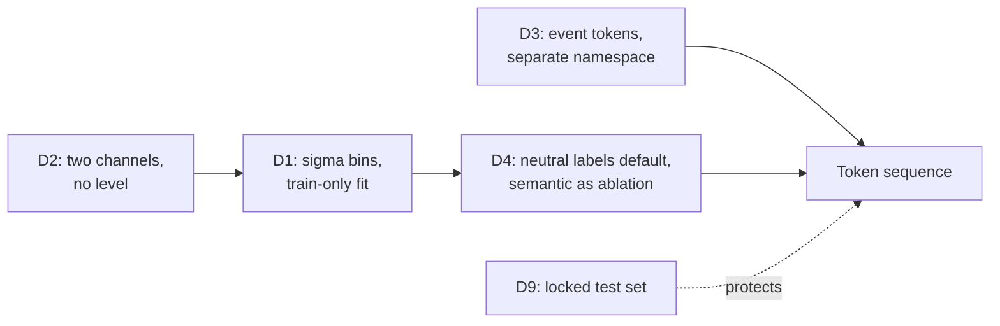

- **D1: sigma-based binning, train-only fit.** The edges are fixed at
  `[-1.5σ, -0.5σ, +0.5σ, +1.5σ]` and come from the training split only. A change to this
  decision needs a written reason.
- **D2: two channels, no `level`.** Only `change` and `volatility`. Phase 0 tried a raw
  level and removed it, because it is not stationary.
- **D3: event tokens in a separate namespace.** They have the `E_` prefix, and `E_NONE`
  is always valid. They are an addition, not a third numeric channel.
- **D4: neutral labels by default, semantic labels as an ablation.** Both label sets
  cover the same 25-token grid. The label set is an experimental variable.
- **D9: the test set is locked.** It has a hash from creation and stays unused until
  the Phase 4 gate. The project counts and reports each read. It does not prevent them.
