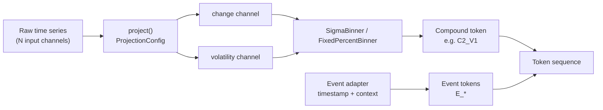

# symbolic-ts

`symbolic-ts` turns a multi-channel numeric time series into a short vocabulary of
discrete tokens — a "symbolic language" for time series. The point of doing this at
all: a small language model can be trained on that token vocabulary the same way it
would be trained on natural-language tokens, and because the vocabulary is built to be
domain-agnostic, a model trained on one domain (e.g. finance) can be evaluated on an
entirely different one (e.g. an industrial sensor dataset) without retraining — the
tokens mean the same thing regardless of where the numbers came from.

This README walks through the three pieces of the pipeline that exist so far —
projection, binning, and vocabulary — in the order data actually flows through them,
with figures generated from the real library code (not illustrations drawn by hand).
Regenerate them any time with:

```bash
.venv/bin/python scripts/generate_readme_figures.py
```

## Pipeline overview



Every domain — finance with a handful of price/volume columns, ETT with 7 sensor
channels, a hypothetical deployment with 100+ sensors — goes through the same three
stages and comes out the other end as tokens drawn from the same fixed vocabulary.
Event tokens (seasonality, calendar effects — `F1-04`) are a separate, additive
namespace layered onto the same sequence, not a fourth numeric channel.

## 1. Channel projection

**Module:** `symbolic_ts/projection.py`

Whatever the input looks like — 1 column or 100 — `project()` reads exactly one of
them (`config.base_reading`) and reduces it to two summary channels: `change` and
`volatility`. Every other input column is ignored. That's the whole trick behind
"domain-agnostic": the function's shape never changes, only the `ProjectionConfig`
does.

```python
from symbolic_ts.projection import project, FINANCE_ADAPTER, ETT_ADAPTER

finance_projected = project(finance_df, FINANCE_ADAPTER)   # reads "Adj Close"
ett_projected = project(ett_df, ETT_ADAPTER)                # reads "OT"
```

A domain adapter is a `ProjectionConfig` value, not an `if domain == ...` branch:

| Adapter | `base_reading` | `change_type` | Why |
|---|---|---|---|
| `FINANCE_ADAPTER` | `Adj Close` | `log_return` | Price grows multiplicatively over a multi-year window, so a raw dollar difference is calibrated to whichever price regime dominates the training slice. A log return isn't. |
| `ETT_ADAPTER` | `OT` | `diff` | The sensor reading has no equivalent growth trend, so a plain difference already holds up. |

There is deliberately **no `level` output channel**. Phase 0 tried tokenizing the raw
level directly and dropped it: a level is non-stationary, so a sigma threshold fit on
one region of a growing/drifting series doesn't describe another region of the same
series. Cumulative `change` already carries the same information a coarse discretized
level would, without that failure mode.

**Missing values:** a NaN in the base reading propagates through `change` (1 row) and
`volatility` (up to `volatility_window` rows, since a rolling std over a window
containing any NaN is itself NaN), and every resulting NaN row is dropped. The output
is guaranteed NaN-free — there's no silent NaN passthrough to debug three stages
downstream.


*Generated from a synthetic geometric random walk standing in for a real price series
— see `scripts/generate_readme_figures.py`. The point isn't the specific numbers, it's
the shape: one noisy input series in, two summary channels out, with volatility
visibly regime-switching (calmer stretches vs. choppier ones) in a way a single raw
level never shows directly.*

## 2. Sigma-based binning

**Module:** `symbolic_ts/binning.py`

Binning turns a continuous `change` or `volatility` value into one of 5 discrete
buckets. `SigmaBinner` does this by measuring how many standard deviations a value
sits from the mean — both computed **once, from the training split only**:

```python
from symbolic_ts.binning import SigmaBinner
from symbolic_ts.vocabulary import NEUTRAL_CHANGE_LABELS

binner = SigmaBinner(labels=NEUTRAL_CHANGE_LABELS).fit(train_change)
tokens = binner.transform(test_change)   # never re-fits
```

The `fit`/`transform` split exists specifically to make a particular mistake
impossible: an earlier prototype ran `qcut` over the *entire* series, which leaks
future statistics into every token derived from it — a test-period token's meaning
would depend partly on test-period data. Calling `transform()` before `fit()`/`load()`
raises `NotFittedError` rather than silently returning garbage.

Bucket edges are fixed at `[-1.5σ, -0.5σ, +0.5σ, +1.5σ]` around the training mean —
5 buckets, `C0` (lowest) through `C4` (highest) for the change channel, `V0`–`V4` for
volatility:


*Same synthetic series as above, first 70% used as the training split. The dashed
lines are the fitted `mean_ ± {0.5, 1.5}·std_` edges — exactly what `fit()` computed,
not hand-placed.*

**`log_scale=True`:** volatility is non-negative and right-skewed, so symmetric sigma
bins on the raw value leave the bottom bucket almost empty — everything piles up near
zero. `log_scale` fits and transforms on `log(x)` instead. Values within
`zero_tolerance` of zero are excluded from the *fit* only (not from transform): a
handful of exact/near-zero training windows would otherwise dominate the variance
calculation once the log transform blows them up into large negative outliers
(measured in the Phase 0 prototype: under 2% of rows inflating the fitted std by
~4.5x). They're still classified correctly at transform time via `log(x + log_epsilon)`.

`FixedPercentBinner` (quantile-based, same `fit`/`transform`/`save`/`load` interface)
exists alongside `SigmaBinner` for the E1 ablation — comparing sigma-based buckets
against fixed-percentage buckets is itself part of the thesis's evaluation, not a
migration from one to the other.

Both binners persist to a JSON calibration artifact via `save()`/`load()`, tagged with
the vocabulary's `SCHEMA_VERSION` — a binner fit under one schema version is a
detectable mismatch, not a silent one, if loaded under another.

## 3. Token vocabulary

**Module:** `symbolic_ts/vocabulary.py`

The vocabulary is the single source of truth for which token strings are valid and
what they mean — every other module (and every downstream consumer) imports labels
from here rather than hardcoding its own. A compound token pairs one change-bucket
label with one volatility-bucket label, e.g. `C2_V1` — "change near the training
mean, volatility one bucket below it." 5 × 5 = 25 possible compound tokens:

| | `V0` | `V1` | `V2` | `V3` | `V4` |
|---|---|---|---|---|---|
| **`C0`** | `C0_V0` | `C0_V1` | `C0_V2` | `C0_V3` | `C0_V4` |
| **`C1`** | `C1_V0` | `C1_V1` | `C1_V2` | `C1_V3` | `C1_V4` |
| **`C2`** | `C2_V0` | `C2_V1` | `C2_V2` | `C2_V3` | `C2_V4` |
| **`C3`** | `C3_V0` | `C3_V1` | `C3_V2` | `C3_V3` | `C3_V4` |
| **`C4`** | `C4_V0` | `C4_V1` | `C4_V2` | `C4_V3` | `C4_V4` |

Two label sets share this same 5×5 shape:

- **Neutral** (`NEUTRAL_TOKENS`, the default): `C0`–`C4` / `V0`–`V4`, as above. No
  label implies a value judgement about what the underlying number means.
- **Semantic** (`SEMANTIC_TOKENS`, an ablation): the same 25 buckets spelled out as
  words — change: `CRASH, DROP, FLAT, RISE, SURGE`; volatility:
  `CALM, LOW, MODERATE, HIGH, SURGE` — e.g. `C_CRASH_V_SURGE`. Comparing model
  performance under neutral vs. semantic labels is itself a research question (does
  giving the model suggestively-named tokens change what it learns?), not just a
  cosmetic choice.

**Event tokens** are a third, additive namespace (`E_` prefix) for information that
isn't a bucketed numeric channel at all — calendar/seasonality effects like "this
timestep is a weekend" or "this timestep is an earnings day." `E_NONE` is always valid
and is emitted explicitly rather than omitted when no event fires, so a token
sequence's length never depends on how many events happened to occur. Domain adapters
register their own event tokens via `register_event_tokens()` — extending the
vocabulary this way is a domain-adapter's job (`F1-04`), not an edit to this module.

`validate_token()` / `validate_sequence()` check a token (or a whole sequence) against
either every currently-known token, or one specific label scheme passed as `allowed=`
— e.g. asserting a model trained on neutral labels never emits a semantic one.
`validate_sequence()` returns a `ValidationReport` with a `conformance_rate`, which is
the actual number this project reports, not "it looked fine."

## Putting it together

```python
from symbolic_ts.projection import project, FINANCE_ADAPTER
from symbolic_ts.binning import SigmaBinner
from symbolic_ts.vocabulary import NEUTRAL_CHANGE_LABELS, NEUTRAL_VOLATILITY_LABELS, validate_sequence

projected = project(raw_df, FINANCE_ADAPTER)
train, test = projected.iloc[:split], projected.iloc[split:]

change_binner = SigmaBinner(labels=NEUTRAL_CHANGE_LABELS).fit(train["change"])
vol_binner = SigmaBinner(labels=NEUTRAL_VOLATILITY_LABELS, log_scale=True).fit(train["volatility"])

change_tokens = change_binner.transform(test["change"])
vol_tokens = vol_binner.transform(test["volatility"])
tokens = [f"{c}_{v}" for c, v in zip(change_tokens, vol_tokens)]

report = validate_sequence(tokens)
assert report.is_valid
```

## Locked design decisions referenced above

These are tracked with full rationale in the project's private working notes; the
short version, for anyone reading this repo:

- **D1 — sigma-based binning, train-only fit.** Fixed `[-1.5σ, -0.5σ, +0.5σ, +1.5σ]`
  edges from the training split only. Changing this requires a written rationale.
- **D2 — two channels, no `level`.** `change` + `volatility` only; a raw level was
  tried in Phase 0 and dropped for non-stationarity.
- **D3 — event tokens as a separate namespace.** `E_` prefix, `E_NONE` always valid,
  additive rather than a third numeric channel.
- **D4 — neutral labels by default, semantic as an ablation.** Both label sets cover
  the same 25-token grid; which one a model sees is an experimental variable.
