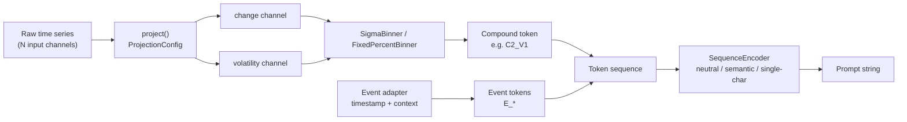
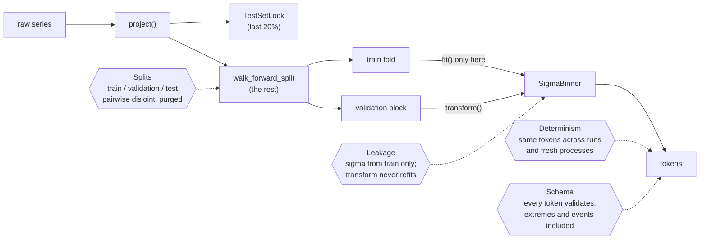

# symbolic-ts

`symbolic-ts` turns a multi-channel numeric time series into a short vocabulary of
discrete tokens — a "symbolic language" for time series. The point of doing this at
all: a small language model can be trained on that token vocabulary the same way it
would be trained on natural-language tokens, and because the vocabulary is built to be
domain-agnostic, a model trained on one domain (e.g. finance) can be evaluated on an
entirely different one (e.g. an industrial sensor dataset) without retraining — the
tokens mean the same thing regardless of where the numbers came from.

This README walks through the pieces of the library that exist so far — projection,
binning, vocabulary, events, encoding, splitting, metrics, and stationarity
helpers — roughly in the order
data actually flows through them, with figures generated from the real library code
(not illustrations drawn by hand). Regenerate them any time with:

```bash
.venv/bin/python scripts/generate_readme_figures.py
```

## Pipeline overview



Every domain — finance with a handful of price/volume columns, ETT with 7 sensor
channels, a hypothetical deployment with 100+ sensors — goes through the same three
stages and comes out the other end as tokens drawn from the same fixed vocabulary.
Event tokens (seasonality, calendar effects — `F1-04`) are a separate, additive
namespace layered onto the same sequence, not a fourth numeric channel. The final step
(`F1-05`) turns the token sequence into the actual string a model reads.

## 1. Channel projection

**Module:** `symbolic_ts/projection.py`

Whatever the input looks like — 1 column or 100 — `project()` reads exactly one of
them (`config.base_reading`) and reduces it to two summary channels: `change` and
`volatility`. Every other input column is ignored. That's the whole trick behind
"domain-agnostic": the function's shape never changes, only the `ProjectionConfig`
does.

```python
from symbolic_ts.projection import project, FINANCE_ADAPTER, ETT_ADAPTER

finance_projected = project(finance_df, FINANCE_ADAPTER)   # reads "Adj Close"
ett_projected = project(ett_df, ETT_ADAPTER)                # reads "OT"
```

A domain adapter is a `ProjectionConfig` value, not an `if domain == ...` branch:

| Adapter | `base_reading` | `change_type` | Why |
|---|---|---|---|
| `FINANCE_ADAPTER` | `Adj Close` | `log_return` | Price grows multiplicatively over a multi-year window, so a raw dollar difference is calibrated to whichever price regime dominates the training slice. A log return isn't. |
| `ETT_ADAPTER` | `OT` | `diff` | The sensor reading has no equivalent growth trend, so a plain difference already holds up. |

There is deliberately **no `level` output channel**. Phase 0 tried tokenizing the raw
level directly and dropped it: a level is non-stationary, so a sigma threshold fit on
one region of a growing/drifting series doesn't describe another region of the same
series. Cumulative `change` already carries the same information a coarse discretized
level would, without that failure mode.

**Missing values:** a NaN in the base reading propagates through `change` (1 row) and
`volatility` (up to `volatility_window` rows, since a rolling std over a window
containing any NaN is itself NaN), and every resulting NaN row is dropped. The output
is guaranteed NaN-free — there's no silent NaN passthrough to debug three stages
downstream.


*Generated from a synthetic geometric random walk standing in for a real price series
— see `scripts/generate_readme_figures.py`. The point isn't the specific numbers, it's
the shape: one noisy input series in, two summary channels out, with volatility
visibly regime-switching (calmer stretches vs. choppier ones) in a way a single raw
level never shows directly.*

## 2. Sigma-based binning

**Module:** `symbolic_ts/binning.py`

Binning turns a continuous `change` or `volatility` value into one of 5 discrete
buckets. `SigmaBinner` does this by measuring how many standard deviations a value
sits from the mean — both computed **once, from the training split only**:

```python
from symbolic_ts.binning import SigmaBinner
from symbolic_ts.vocabulary import NEUTRAL_CHANGE_LABELS

binner = SigmaBinner(labels=NEUTRAL_CHANGE_LABELS).fit(train_change)
tokens = binner.transform(test_change)   # never re-fits
```

The `fit`/`transform` split exists specifically to make a particular mistake
impossible: an earlier prototype ran `qcut` over the *entire* series, which leaks
future statistics into every token derived from it — a test-period token's meaning
would depend partly on test-period data. Calling `transform()` before `fit()`/`load()`
raises `NotFittedError` rather than silently returning garbage.

Bucket edges are fixed at `[-1.5σ, -0.5σ, +0.5σ, +1.5σ]` around the training mean —
5 buckets, `C0` (lowest) through `C4` (highest) for the change channel, `V0`–`V4` for
volatility:


*Same synthetic series as above, first 70% used as the training split. The dashed
lines are the fitted `mean_ ± {0.5, 1.5}·std_` edges — exactly what `fit()` computed,
not hand-placed.*

**`log_scale=True`:** volatility is non-negative and right-skewed, so symmetric sigma
bins on the raw value leave the bottom bucket almost empty — everything piles up near
zero. `log_scale` fits and transforms on `log(x)` instead. Values within
`zero_tolerance` of zero are excluded from the *fit* only (not from transform): a
handful of exact/near-zero training windows would otherwise dominate the variance
calculation once the log transform blows them up into large negative outliers
(measured in the Phase 0 prototype: under 2% of rows inflating the fitted std by
~4.5x). They're still classified correctly at transform time via `log(x + log_epsilon)`.

`FixedPercentBinner` (quantile-based, same `fit`/`transform`/`save`/`load` interface)
exists alongside `SigmaBinner` for the E1 ablation — comparing sigma-based buckets
against fixed-percentage buckets is itself part of the thesis's evaluation, not a
migration from one to the other.

**Missing values are refused, not binned.** `np.digitize` puts NaN in the *top*
bucket, so a gap in the data would silently become `C4` — an "extreme up-move" token
that validates against the schema and means the wrong thing. Both binners raise
`ValueError` on NaN in `fit` (where it would also make `mean_`/`std_` NaN and every
later token `C4`) and in `transform`; `±inf` still map to `C0`/`C4`, which is correct.
`log_scale` additionally refuses negative input, whose log is NaN.

Both binners persist to a JSON calibration artifact via `save()`/`load()`, tagged with
the vocabulary's `SCHEMA_VERSION` — a binner fit under one schema version is a
detectable mismatch, not a silent one, if loaded under another.

## 3. Token vocabulary

**Module:** `symbolic_ts/vocabulary.py`

The vocabulary is the single source of truth for which token strings are valid and
what they mean — every other module (and every downstream consumer) imports labels
from here rather than hardcoding its own. A compound token pairs one change-bucket
label with one volatility-bucket label, e.g. `C2_V1` — "change near the training
mean, volatility one bucket below it." 5 × 5 = 25 possible compound tokens:

| | `V0` | `V1` | `V2` | `V3` | `V4` |
|---|---|---|---|---|---|
| **`C0`** | `C0_V0` | `C0_V1` | `C0_V2` | `C0_V3` | `C0_V4` |
| **`C1`** | `C1_V0` | `C1_V1` | `C1_V2` | `C1_V3` | `C1_V4` |
| **`C2`** | `C2_V0` | `C2_V1` | `C2_V2` | `C2_V3` | `C2_V4` |
| **`C3`** | `C3_V0` | `C3_V1` | `C3_V2` | `C3_V3` | `C3_V4` |
| **`C4`** | `C4_V0` | `C4_V1` | `C4_V2` | `C4_V3` | `C4_V4` |

Two label sets share this same 5×5 shape:

- **Neutral** (`NEUTRAL_TOKENS`, the default): `C0`–`C4` / `V0`–`V4`, as above. No
  label implies a value judgement about what the underlying number means.
- **Semantic** (`SEMANTIC_TOKENS`, an ablation): the same 25 buckets spelled out as
  words — change: `CRASH, DROP, FLAT, RISE, SURGE`; volatility:
  `CALM, LOW, MODERATE, HIGH, SURGE` — e.g. `C_CRASH_V_SURGE`. Comparing model
  performance under neutral vs. semantic labels is itself a research question (does
  giving the model suggestively-named tokens change what it learns?), not just a
  cosmetic choice.

**Event tokens** are a third, additive namespace (`E_` prefix) for information that
isn't a bucketed numeric channel at all — calendar/seasonality effects like "this
timestep is a weekend" or "this timestep is an earnings day." `E_NONE` is always valid
and is emitted explicitly rather than omitted when no event fires, so a token
sequence's length never depends on how many events happened to occur. Domain adapters
register their own event tokens via `register_event_tokens()` — extending the
vocabulary this way is a domain-adapter's job (`F1-04`), not an edit to this module.

`validate_token()` / `validate_sequence()` check a token (or a whole sequence) against
either every currently-known token, or one specific label scheme passed as `allowed=`
— e.g. asserting a model trained on neutral labels never emits a semantic one.
`validate_sequence()` returns a `ValidationReport` with a `conformance_rate`, which is
the actual number this project reports, not "it looked fine."

## 4. Event tokens

**Module:** `symbolic_ts/events.py`

A domain event adapter maps one timestamp (plus optional metadata) to zero or more
event tokens. `EventAdapter` is a *structural* protocol, not a base class — any object
with a matching `events_for()` method satisfies it, so a third domain never requires
editing this module, only calling `register_event_adapter("my_domain", my_adapter)`.

```python
from symbolic_ts.events import ETTEventAdapter

adapter = ETTEventAdapter(
    holiday_dates=frozenset({date(2024, 3, 1)}),
    peak_hours=frozenset({18, 19, 20}),
)
adapter.events_for(datetime(2024, 3, 1, 19))  # -> ["E_HOLIDAY", "E_HOUR_PEAK", "E_SEASON_CHANGE"]
adapter.events_for(datetime(2024, 3, 4, 9))   # -> ["E_NONE"] -- explicit, never []
```

`holiday_dates` and `peak_hours` are caller-supplied with **no built-in default** —
Phase 0 (F0-09) established that ETT has a genuine, exact 24-hour seasonal cycle worth
flagging, but never measured a specific peak clock hour or holiday calendar, so a
hardcoded default here would be an unbacked number. `FinanceEventAdapter` follows the
same shape for earnings/dividend/FOMC dates.


*A configured holiday landing on March 1st lines up with `E_SEASON_CHANGE` (meteorological
spring starts the same day) purely by choice of example date — the two are otherwise
independent checks. `E_HOUR_PEAK` fires identically every day because `peak_hours` is a
fixed set of clock hours, not calendar-aware.*

Every event token an adapter can emit is registered with the vocabulary in the
adapter's `__post_init__` — by the time `events_for()` returns a token, `validate_token()`
already recognises it.

## 5. Sequence encoders

**Module:** `symbolic_ts/encoding.py`

The last step turns a token sequence into the actual string a model reads. Three
encoders share one interface because comparing them **is** the E2–E4 representation
ablation (`WORKING_PLAN.md`), not a preference for one over the others — all three
re-render the *same* input sequence rather than requiring a separately-fit binner per
label scheme:

```python
from symbolic_ts.encoding import NEUTRAL_ENCODER, SEMANTIC_ENCODER, SINGLE_CHAR_ENCODER

NEUTRAL_ENCODER.encode(tokens).text      # "C2_V1 E_NONE C0_V4 ..."
SEMANTIC_ENCODER.encode(tokens).text     # "C_FLAT_V_LOW E_NONE C_CRASH_V_SURGE ..."
SINGLE_CHAR_ENCODER.encode(tokens).text  # "L E_NONE D ..."
```


*Character count, not subword-token count — this figure only needs to be reproducible
offline, so it uses a one-character-per-token stand-in tokenizer, not a real one. The
actual subword-token figures that motivated `single_char` in the first place
(semantic ≈ 6.7 tokens/symbol, single-character ≈ 1 token/symbol, measured under a real
tokeniser) are recorded in `symbolic-ts-research`'s F0-09 notes, not recomputed here.*

`single_char` exists specifically because semantic labels are expensive: at ~5–7
subword tokens per compound symbol, a 50-symbol context alone can consume a third of a
0.5B model's practical prompt budget before any surrounding instruction text.

`EncodedSequence.token_count(tokenizer)` accepts anything with an `encode(text) ->
Sequence` method — a Hugging Face tokenizer satisfies this today, so the library never
takes a hard dependency on a specific tokenizer package, matching `ProjectionConfig`'s
stance that the model-specific pieces are supplied by the caller. `.metadata` carries
`{"encoding": ..., "schema_version": ...}` for MLflow logging. `decode()` always
reconstructs the canonical neutral spelling, regardless of which encoder produced the
text, so downstream code never has to branch on which encoding was used upstream.

## 6. Splits, purging, and the test-set lock

**Module:** `symbolic_ts/splits.py`

`walk_forward_split()` produces expanding-window folds for development, each with a
purge gap between training and validation sized to `context_len + embargo` — without
it, a training target near the fold boundary would use an input window reaching into
what the validation fold is being scored on, and the model would effectively train on
a preview of its own evaluation.

```python
from symbolic_ts.splits import walk_forward_split

folds = walk_forward_split(data, n_folds=4, context_len=50, embargo=5)
for fold in folds:
    train = data.iloc[fold.train_indices]
    validation = data.iloc[fold.validation_indices]
```


*Each fold's training window expands to include everything before its own purge gap
— fold 2 trains on far more data than fold 0, which is the point of walk-forward
validation over a fixed train/test split: every fold still respects chronological
order.*

Separately, `TestSetLock` implements decision D9: the real held-out test set is locked
once, hashed at creation (over the actual data values, not just its indices — a silent
edit to the underlying data would change the hash), and every subsequent `.read()`
increments `test_peek_count`, raises `TestSetAccessWarning`, and best-effort logs the
count to MLflow if it's installed and a run is active. It doesn't block access — the
model genuinely has to run on the test set at the Phase 4 gate — it makes access
impossible to do *silently*, since every read must be reported in the thesis per D9.

```python
from symbolic_ts.splits import TestSetLock

lock = TestSetLock.create(full_series, test_fraction=0.2)  # last 20%, chronological
lock.save("test_lock.json")
...
test_indices = lock.read()  # warns, increments test_peek_count, logs to MLflow
lock.save("test_lock.json")  # persist the incremented count
```

## 7. Metrics

**Module:** `symbolic_ts/metrics.py`

Every metric and statistical test the thesis reports, in one place, each checked
against a worked numeric example with its source cited in the function's own
docstring — a published one (Wikipedia's cited primary sources, NIST's Statistical
Engineering Handbook, scikit-learn's documented examples) wherever one exists, a
hand-constructed and hand-verified one where it doesn't (labelled honestly as such,
never misattributed).

```python
from symbolic_ts.metrics import rmse, mae, directional_accuracy
from symbolic_ts.metrics import confusion_matrix, accuracy, macro_f1, mcc
from symbolic_ts.metrics import wilson_score_interval
from symbolic_ts.metrics import mcnemar_test, diebold_mariano_test, holm_correction

wilson_score_interval(successes=42, n=50, confidence=0.95)
mcnemar_test([[a, b], [c, d]])              # exact vs. chi-square chosen automatically
diebold_mariano_test(errors_a, errors_b)    # forecast-accuracy comparison
holm_correction([p1, p2, p3], alpha=0.05)   # once more than one pair gets compared
```

`wilson_score_interval` exists instead of the textbook normal (Wald) interval because
Wald's coverage breaks down exactly where this project needs it most — evaluating a
classifier's accuracy, which is a proportion, often reported near the extremes:


*At `p_hat=0.05` (a plausible per-class hit rate on a 25-token vocabulary), Wald's
lower bound is negative for `n` below roughly 100 — a probability cannot be negative,
so the interval itself is nonsensical exactly where sample sizes are realistically
small. Wilson's is asymmetric and stays inside `[0, 1]` throughout.*

`mcnemar_test` and `diebold_mariano_test` are the two paired significance tests the
literature in this area actually uses — McNemar for comparing two classifiers' errors
on the *same* test items, Diebold-Mariano for comparing two forecasts' accuracy — and
`holm_correction` exists because running either test across every meaningful model
pair (as `F4-02` will) means correcting for multiple comparisons, not reporting each
pair's raw p-value as if it were the only comparison made.

## 8. Stationarity helpers

**Module:** `symbolic_ts/stationarity.py`

The questions behind two design decisions — *which transform makes the series
stationary?* (why `change` is a difference, `F0-03`) and *how far back does the
memory reach?* (why the context window is 50 tokens, `F0-09`) — are answered with
ADF, KPSS, ACF and PACF. This module is the one implementation of those four, so the
Phase 0 analyses and the thesis pipeline produce the same numbers from the same code.

```python
from symbolic_ts.stationarity import adf_test, kpss_test, acf_with_bounds, pacf_with_bounds

adf = adf_test(series)            # StationarityTestResult: statistic, p_value, lags, critical_values
kpss = kpss_test(series)
adf.is_stationary, kpss.is_stationary

acf = acf_with_bounds(tokens, nlags=300)   # Correlogram: lags, values, bounds
pacf = pacf_with_bounds(tokens, nlags=50)
pacf.outside_bounds()                       # which lags are significant
acf.first_lag_within_bounds(consecutive=3)  # where the series decorrelates
```

**Two tests, opposite nulls.** ADF's null hypothesis is a unit root (non-stationary);
KPSS's is stationarity. "Rejected" therefore means opposite things for the two, which
is an easy bug to write in every script that calls them. `is_stationary` resolves it
once:

| | ADF (H0: unit root) | KPSS (H0: stationary) |
|---|---|---|
| p < alpha | stationary | non-stationary |
| p >= alpha | non-stationary | stationary |

Running both is the point: when they agree, the conclusion is solid; when they
disagree (ADF says stationary, KPSS says not — what `F0-03` saw on raw ETT), that is
the signature of a slowly moving mean, i.e. seasonality, not a random walk. KPSS
p-values come from a table that only covers [0.01, 0.1]; outside it the value is
clipped to the edge, and `p_value_clipped` says so instead of letting a clipped 0.01
pass for the real p-value.

**Why the ACF bound widens and the PACF bound doesn't.** The band an autocorrelation
is compared against matters as much as the value itself:


*An AR(1) series (phi=0.8, n=300) generated with a fixed seed, run through the real
`acf_with_bounds` / `pacf_with_bounds`. Left: the ACF decays slowly. Bartlett's bound
(shaded) widens with every autocorrelation already estimated below it; the constant
white-noise band (dashed) would also flag lags 6, 11-12 and 24-30 as "significant",
when Bartlett's bound puts only lags 1-5 outside. Right: the PACF cuts off after lag 1, exactly what an
AR(1) should do. The two small crossings at lags 10 and 25 are what a 95% band
produces by chance over 30 lags (about 1.5 expected) — which is also why
`first_lag_within_bounds` asks for several consecutive lags inside the band, not one.*

This is the reasoning behind the context window: a long ACF tail can be propagation
through short direct memory, and the PACF is what separates the two. ADF/KPSS are
validated against the worked sunspots example in statsmodels' own documentation; the
Bartlett bound against the formula on NIST's autocorrelation-plot page (both cited in
the docstrings).

## 9. Thesis invariants: what the test suite guards

**File:** `tests/test_thesis_invariants.py` (pipeline: `tests/_pipeline.py`)

Each module has its own unit tests. This file is different: it runs the real pipeline
end to end — `project()` → test-set lock → walk-forward split → binners fit on the
training fold → tokens — and checks the four ways a thesis number could be wrong without
any single module being "broken":



| Invariant | Why it threatens a result | How it is checked |
|---|---|---|
| Determinism | A token stream that differs between runs makes every metric unreproducible | SHA-256 of the full token output, in-process and in two fresh interpreters with different `PYTHONHASHSEED` |
| Leakage | Sigma fit on data that includes the future quietly calibrates tokens to the test period | Train-fold sigma differs from full-data sigma on a series whose volatility doubles halfway; `fit` is patched to fail and `transform` still runs; a reloaded calibration reproduces tokens with no fit |
| Schema | An out-of-vocabulary or wrongly-meaning token corrupts training data silently | Every emitted token validates, including spikes beyond ±1.5σ, zero-volatility stretches and interleaved event tokens; NaN is refused rather than becoming `C4` |
| Splits | Overlapping indices let a model be tuned on what it is evaluated on | For 1, 3 and 5 folds: train, validation and the locked test split are pairwise disjoint, the purge gap exceeds the context window, and everything precedes the test split |

`tests/conftest.py` isolates two kinds of global state so that results don't depend on
test order: the event-token registry (constructing an adapter registers its tokens) and
MLflow (a test-split read logs `test_peek_count`; the run is redirected to a temporary
directory and closed). CI (`.github/workflows/tests.yml`) runs the whole suite on every
push, on Python 3.10 and 3.12.

## Putting it together

```python
from symbolic_ts.projection import project, FINANCE_ADAPTER
from symbolic_ts.binning import SigmaBinner
from symbolic_ts.vocabulary import NEUTRAL_CHANGE_LABELS, NEUTRAL_VOLATILITY_LABELS, validate_sequence
from symbolic_ts.events import FinanceEventAdapter
from symbolic_ts.encoding import NEUTRAL_ENCODER

projected = project(raw_df, FINANCE_ADAPTER)
train, test = projected.iloc[:split], projected.iloc[split:]

change_binner = SigmaBinner(labels=NEUTRAL_CHANGE_LABELS).fit(train["change"])
vol_binner = SigmaBinner(labels=NEUTRAL_VOLATILITY_LABELS, log_scale=True).fit(train["volatility"])

change_tokens = change_binner.transform(test["change"])
vol_tokens = vol_binner.transform(test["volatility"])
tokens = [f"{c}_{v}" for c, v in zip(change_tokens, vol_tokens)]

report = validate_sequence(tokens)
assert report.is_valid

event_adapter = FinanceEventAdapter(earnings_dates=frozenset({...}))
events = [event_adapter.events_for(ts) for ts in test.index]  # one list per timestep

encoded = NEUTRAL_ENCODER.encode(tokens)  # -> the actual prompt string
```

## Locked design decisions referenced above

These are tracked with full rationale in the project's private working notes; the
short version, for anyone reading this repo:

- **D1 — sigma-based binning, train-only fit.** Fixed `[-1.5σ, -0.5σ, +0.5σ, +1.5σ]`
  edges from the training split only. Changing this requires a written rationale.
- **D2 — two channels, no `level`.** `change` + `volatility` only; a raw level was
  tried in Phase 0 and dropped for non-stationarity.
- **D3 — event tokens as a separate namespace.** `E_` prefix, `E_NONE` always valid,
  additive rather than a third numeric channel.
- **D4 — neutral labels by default, semantic as an ablation.** Both label sets cover
  the same 25-token grid; which one a model sees is an experimental variable.
- **D9 — the test set is locked.** Hashed at creation, untouched until the Phase 4
  gate; every read is counted and reported, not prevented.
